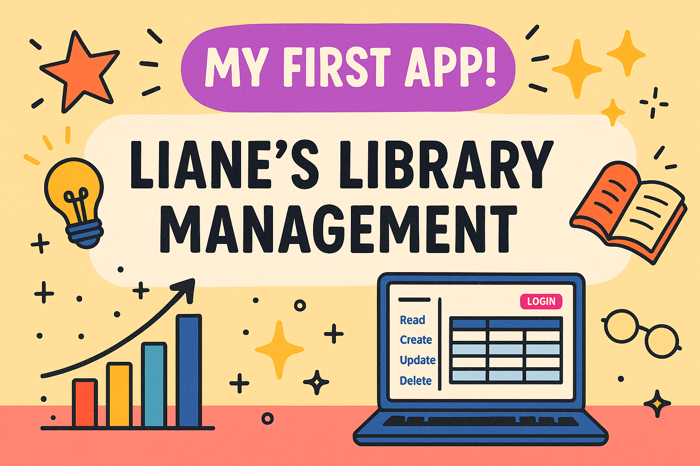

# Liane's Library Management

A simple, no-code-friendly Streamlit app to manage Liane's personal book collection and track loans.  
Built with CRUD operations for books, friends, and loans to ensure no more lost books!

## Features

- Add, view, update, and delete books, friends, and loans  
- Track who has borrowed what and when items are due  
- Friendly UI with multiple pages for easy navigation  
- Login authentication for secure access  
- Uses a MySQL database backend (schema & sample data included)

## Setup

1. **Clone the repository**  
   ```bash
   git clone https://github.com/yourusername/lianes-library-management.git
   cd lianes-library-management
   ```
2. **Setup MySQL database** 

Import the SQL schema and sample data from data/lianes_library.sql into your MySQL server.

Update your database credentials in app/library_connection.py.

3. **Install Python dependencies**
  ```bash
  pip install -r requirements.txt
  ```
4. **Run the Streamlit app**
  ```bash
  streamlit run app/main.py
  ```
Repository Structure
  ```pgsql
lianes-library-management/
│
├── data/                      # SQL schema and sample data
│   └── lianes_library.sql
│
├── app/                       # Streamlit app modules
│   ├── library_connection.py  # Database connection & helpers
│   ├── login.py               # User login/authentication
│   ├── read.py                # Display data pages
│   ├── create.py              # Add new records
│   ├── update.py              # Update existing records
│   ├── delete.py              # Delete records
│   └── main.py                # Multipage app entrypoint
│
├── requirements.txt           # Python dependencies
├── README.md                  # Project overview and instructions
└── .gitignore                 # Git ignore rules
  ```
5. **Technologies Used**
Python 3.x
Streamlit
MySQL

## Contact
For questions or collaboration, please contact:
Carlos Montefusco – cmontefusco@gmail.com


